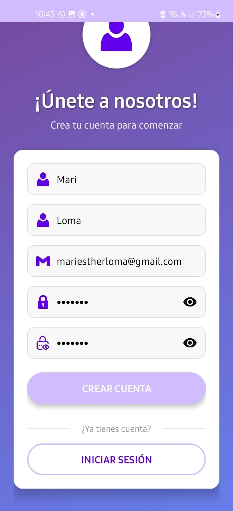
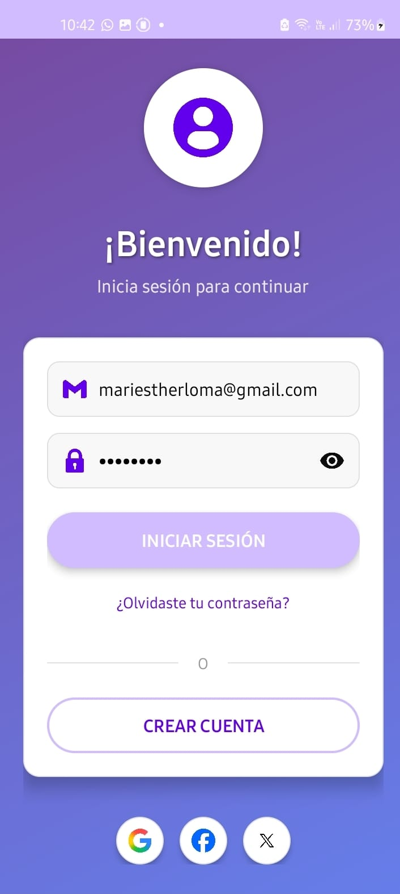
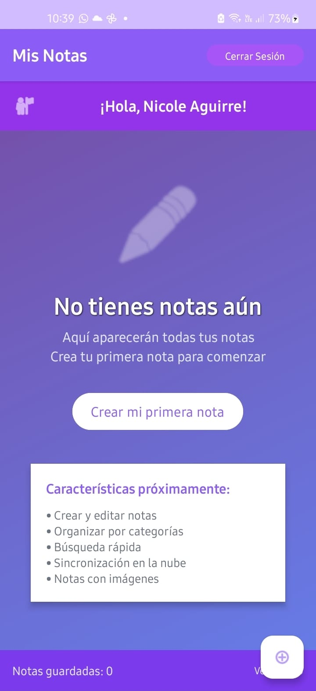
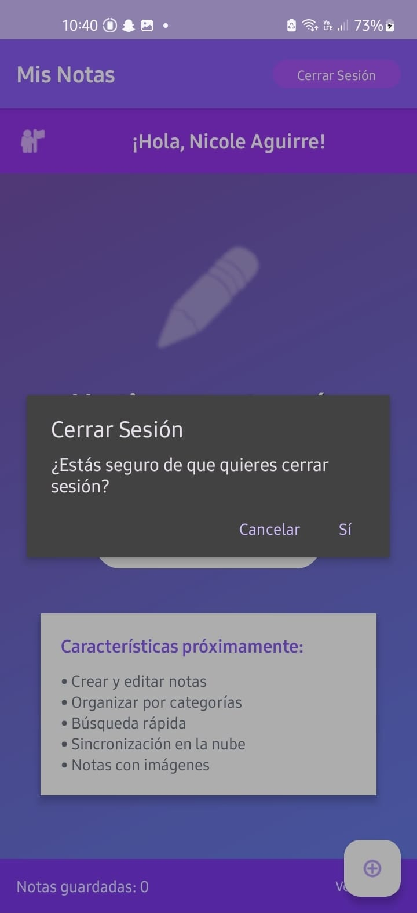
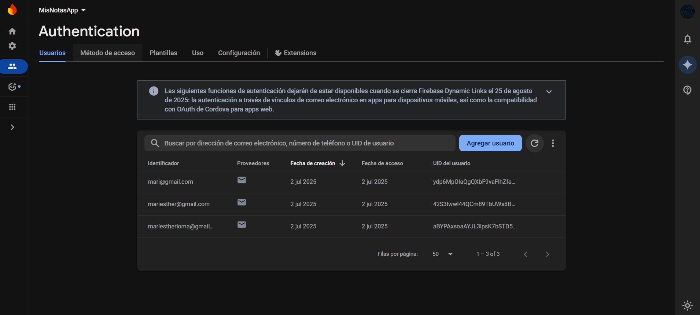
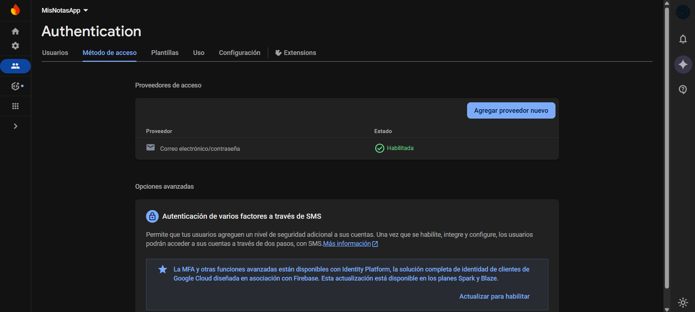

# **MyNotes App - S10**

Aplicación Android de notas con autenticación completa usando Firebase Authentication y Firestore Database, diseñada para gestión segura de notas personales.

## **📱 Descripción**

Esta aplicación implementa un sistema completo de gestión de notas con autenticación de usuarios que permite:
* Sistema de registro e inicio de sesión con Firebase Authentication
* Gestión segura de perfiles de usuario con validación completa
* Almacenamiento en la nube con Firestore Database
* Interfaz moderna con gradientes y efectos visuales
* Validación robusta de formularios con manejo de errores

## **🚀 Características**

* **Autenticación Firebase**: Registro e inicio de sesión seguro con email y contraseña
* **Validación Completa**: Validación de formato de email, fortaleza de contraseña y campos obligatorios
* **Perfil de Usuario**: Gestión de nombres, apellidos y información personal
* **UI/UX Moderna**: Diseño con gradientes, tarjetas elevadas y animaciones
* **Responsive Design**: Layouts adaptables con ScrollView y ConstraintLayout

## **📋 Requisitos**

* Android Studio Hedgehog o superior
* SDK mínimo: API 21 (Android 5.0)
* SDK objetivo: API 34 (Android 14)
* Kotlin 1.9.0
* Firebase Project configurado
* Conexión a Internet para autenticación

## **💻 Uso**

### **Pantalla de Registro**
1. **Crear cuenta**: Completa nombre, apellido, email y contraseña
2. **Validación automática**: La app verifica formato de email y fortaleza de contraseña
3. **Confirmación**: Confirma tu contraseña para evitar errores
4. **Registro exitoso**: Recibe confirmación y redirección automática al login



### **Pantalla de Login**
1. **Iniciar sesión**: Usa las credenciales creadas en el registro
2. **Validación**: Verifica que el email y contraseña sean correctos
3. **Acceso a la app**: Ingresa a la aplicación principal tras autenticación exitosa



### **Pantalla de Main**
1. **Pantalla inicial**: Muestra cómo se ve la pantalla inicial de notas (solo es vista)




2. **Cerrar sesión**: Sale una confirmación para saber si quiere cerrar sesión o no.




### **FIREBASE**







## **📂 Estructura del Proyecto**

```
S10_MyNotes/
├── app/
│   └── src/
│       └── main/
│           ├── java/com/example/s10_mynotes/
│           │   ├── RegisterActivity.kt
│           │   ├── LoginActivity.kt
│           │   └── MainActivity.kt
│           ├── res/
│           │   ├── layout/
│           │   │   ├── activity_register.xml
│           │   │   ├── activity_login.xml
│           │   │   └── activity_main.xml
│           │   ├── drawable/
│           │   │   ├── gradient_background.xml
│           │   │   ├── card_background.xml
│           │   │   ├── input_background.xml
│           │   │   ├── button_gradient.xml
│           │   │   ├── button_outline.xml
│           │   │   └── circle_white_background.xml
│           │   ├── values/
│           │   │   ├── colors.xml
│           │   │   ├── strings.xml
│           │   │   └── themes.xml
│           │   └── mipmap/
│           └── AndroidManifest.xml
├── google-services.json
└── README.md
```

## **🎯 Funcionalidades Implementadas**

### **1. Sistema de Registro**
- Formulario con validación completa de campos
- Verificación de formato de email con Android Patterns
- Validación de fortaleza de contraseña (letra + número)
- Confirmación de contraseña
- Creación de perfil en Firestore Database
- Manejo de errores específicos (email existente, contraseña débil)

### **2. Autenticación Firebase**
- Integración con Firebase Authentication
- Creación de usuarios con email y contraseña
- Actualización de perfil con displayName
- Almacenamiento seguro de datos de usuario
- Manejo de excepciones de Firebase

### **3. Interfaz de Usuario**
- Gradientes de fondo atractivos
- Tarjetas elevadas con shadow effects
- Campos de entrada con iconos
- Botones con efectos de gradiente
- Progress bars para estados de carga
- Mensajes Toast para feedback

### **4. Validaciones y Seguridad**
- Validación de campos obligatorios
- Verificación de longitud mínima de nombres
- Validación de formato de email
- Contraseña mínimo 6 caracteres
- Verificación de fortaleza de contraseña
- Coincidencia de contraseñas

